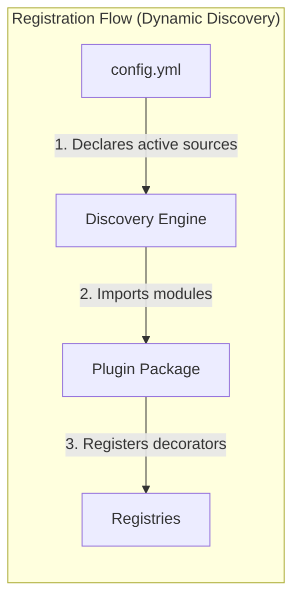
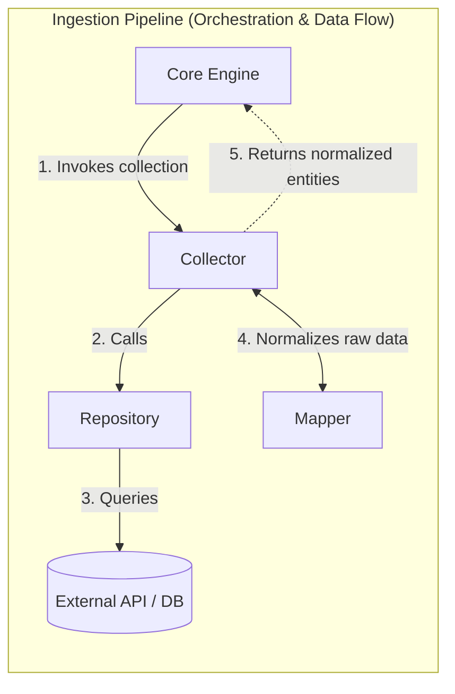
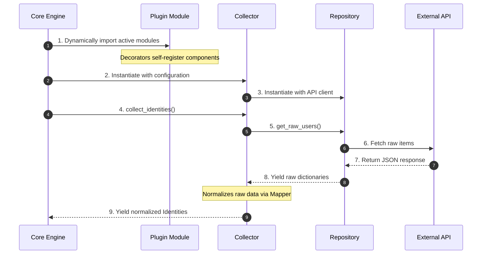

# 🧩 Plugin Development Guide

> ⚠️ **Warning:** This documentation is a work in progress. Some sections may be incomplete, inaccurate, or subject to change.

This guide explains how to develop a plugin for **Assets Guardian**. Each plugin integrates an external Identity and Access Management (IAM) source (GitLab, Microsoft 365, Dolibarr, etc.) into the framework without modifying the core codebase.

## Architecture Overview

Assets Guardian uses a **registry-based plugin architecture**. Plugins are discovered dynamically at runtime based on the application configuration. The framework scans the `plugins/` directory, imports configured plugin modules, and collects components registered via decorators.





### Key Design Principles

- **Configuration-driven loading**: A plugin is imported and loaded **only** if its source name appears in `config.yml`. Unconfigured plugins remain inert.
- **Mode-aware discovery**: Components are selectively loaded based on execution mode:
    - **SYNC mode**: Loads core interfaces + `ISheetBuilder`.
    - **AUDIT mode**: Loads core interfaces + `IRule` & `IPDFBuilder`.
- **Decorator registration**: Components self-register via class decorators (e.g. `@CollectorRegistry.register("myplugin")`).
- **Multi-instance support**: The framework supports configuring multiple named instances for the same plugin (e.g., `prod`, `staging`), each with independent configs.

## Plugin Directory Structure

A standard plugin resides in `src/assets_guardian/plugins/` and follows this layout:

```text
plugins/
└── myplugin/
    ├── __init__.py          # Marks the directory as a Python package
    ├── constants.py         # SOURCE_NAME, role mappings, and other constants
    ├── client.py            # IClientProvider - creates the connection client
    ├── repository.py        # IRepository - fetches raw data from the external source
    ├── mapper.py            # IMapper - normalizes raw data to domain models
    ├── collector.py         # Collector - orchestrates repository and mapper
    ├── rules.py             # Optional - IRule implementations (audit mode only)
    ├── sheet_builders.py    # Optional - ISheetBuilder implementation (sync mode only)
    └── pdf_builder.py       # Optional - IPDFBuilder implementation (audit mode only)
```

> Only `constants.py`, `client.py`, `repository.py`, `mapper.py`, and `collector.py` are strictly required. The rest are optional extensions depending on whether your plugin supports custom audit sheets or custom PDF reports.

## Core Interfaces (Required)

### `IClientProvider`

**File:** `core/domain/ports/client.py`
**Purpose:** Establish and health-check the connection client for the external source.

```python
class IClientProvider(ABC):
    """Port: Client provider used to collect data.

    Defines the contract for obtaining a client
    specific to a data source.
    """

    def __init__(self, config: dict[str, Any]) -> None:
        """Initialize the client provider with the instance's configuration dictionary."""
        raise NotImplementedError

    @abstractmethod
    def instantiate_client(self) -> HttpClient | MySQLClient | Any:
        """Returns a ready-to-use client.

        The return type depends on the specific implementation (e.g., GraphServiceClient,
        requests Session, GitLab client, etc.).
        """
        raise NotImplementedError

    @abstractmethod
    def health_check(self) -> bool:
        """Verifies that the client connection, return True if the remote service is reachable and credentials are valid, else False."""  # noqa: E501
        raise NotImplementedError
```

> `health_check` must never raise exceptions. Always catch connection errors, log them, and return `False`.

**Example:**

```python
@ClientProviderRegistry.register("myplugin")
class MyPluginClientProvider(IClientProvider):
    def __init__(self, config: dict[str, Any]) -> None:
        self.__config = config

    def instantiate_client(self) -> HttpClient:
        token = self.__config["credentials"]["api_token"]
        return HttpClient(
            base_url=self.__config["url"],
            headers={"Authorization": f"Bearer {token}"},
        )

    def health_check(self) -> bool:
        try:
            client = self.instantiate_client()
            return client.get("/health").status_code == 200
        except Exception as e:
            logger.error(f"Health check failed for myplugin: {e}")
            return False
```

### `IRepository`

**File:** `core/domain/ports/repository.py`
**Purpose:** Retrieve raw JSON/dict payloads from the external system.

```python
class IRepository(ABC):
    """Port: Raw data repository access.

    Defines the contract for retrieving raw data
    from an external source (API, database, etc.).
    """

    @abstractmethod
    def get_raw_users(self) -> Iterable[dict[str, Any]]:
        """Retrieves the raw list of users."""
        raise NotImplementedError

    @abstractmethod
    def get_raw_assets(self) -> Iterable[dict[str, Any]]:
        """Retrieves the raw list of assets (projects, sites, etc.)."""
        raise NotImplementedError

    @abstractmethod
    def get_raw_accesses(self) -> Iterable[dict[str, Any]]:
        """Retrieves the raw list of accesses/permissions."""
        raise NotImplementedError
```

> Return `Iterable` (generators or lazy iterables) to optimize memory footprint when fetching large quantities of records.

**Example:**

> TODO: Complete with an example...

```python
```

### `IMapper`

**File:** `core/domain/ports/mapper.py`
**Purpose:** Pure data normalization. Converts raw, source-specific payloads into clean, strongly typed Assets Guardian domain models (`Identity`, `Asset`, `Access`).

```python
class IMapper(ABC):
    """Port: Data normalizer (mapper).

    Defines the contract for converting raw data from APIs
    to the domain's normalized data models.
    """

    @property
    @abstractmethod
    def source_name(self) -> str:
        """Unique source name (must match config.yml)."""
        raise NotImplementedError

    @property
    @abstractmethod
    def instance_id(self) -> str:
        """The specific instance identifier (e.g., 'main', 'prod')."""
        raise NotImplementedError

    @abstractmethod
    def to_identity(self, raw_data: Any) -> Identity:
        """Converts raw data to an Identity object."""
        raise NotImplementedError

    @abstractmethod
    def to_asset(self, raw_data: Any) -> Asset:
        """Converts raw data to an Asset object."""
        raise NotImplementedError

    @abstractmethod
    def to_access(self, raw_data: Any, asset: Asset | None = None) -> Access:
        """Converts raw data to an Access object."""
        raise NotImplementedError
```

**Example:**

> TODO: Complete with an example...

```python
```

### `Collector`

**File:** `core/domain/ports/collector.py`
**Purpose:** Orchestrates the ingestion pipeline. It coordinates the repository (data retrieval) and mapper (data translation).

```python
class Collector:
    def __init__(self, client: Any, instance_config: dict[str, Any]) -> None:
        self._client = client
        self._config = instance_config
        self._repository: IRepository
        self._mapper: IMapper

    @property
    def source_name(self) -> str: ...

    @property
    def instance_id(self) -> str: ...

    def collect_identities(self) -> Iterable[Identity]: ...
    def collect_assets(self) -> Iterable[Asset]: ...
    def collect_accesses(self) -> Iterable[Access]: ...
    def collect_groups(self) -> Iterable[Any]: ...
    def collect_permissions(self) -> Iterable[Any]: ...
```

> The base `Collector` class provides default loop implementations that fetch raw items from the repository and map them. You only need to override `collect_*` methods if you require custom filtering, secondary API requests, or advanced orchestration.

**Example:**

> TODO: Complete with an example...

```python
```

## Optional Interfaces

### `ISheetBuilder` (Sync Mode)

**File:** `core/domain/ports/sheet_builders.py`
**Purpose:** Dictates how sync data is printed to the output Excel reference sheet and which manual columns should be protected during regenerations.

> TODO: Clarify that this interface describes an optional integration to override, at the plugin level, the Excel sheet building logic.

```python
class ISheetBuilder(ABC):
    """Port: Excel sheet builder (Plugin).

    Contract for plugins wishing to add specific sheets
    to the Excel referential.
    """

    # Injected by the registry upon registration
    source_name: str = ""

    @property
    @abstractmethod
    def sheet_names(self) -> list[str]:
        """List of Excel sheet names managed by this builder."""
        raise NotImplementedError

    @property
    @abstractmethod
    def preserved_columns(self) -> dict[str, dict[str, list[str]]]:
        """Defines the columns to preserve per sheet.

        Example::

            {
                'Sheet1': {'primary_keys': ['ID'], 'columns': ['Comments']},
                'Sheet2': {'primary_keys': ['UUID'], 'columns': ['Account Type']}
            }
        """
        raise NotImplementedError

    @abstractmethod
    def get_rules(self) -> dict[str, Any]:
        """Returns plugin-specific Excel formatting rules."""
        raise NotImplementedError

    @abstractmethod
    def build(
        self,
        worksheet: Any,
        data: Any,
        preserved: Any,
        rules: Any,
    ) -> None:
        """Builds the Excel sheet for this plugin.

        Args:
            worksheet: The Excel sheet (ExcelWorksheet).
            data: Dictionary of collection results (source, instance) -> CollectorResult.
            preserved: Manual data extracted from the existing sheet for preservation.
            rules: Formatting and validation rules.
        """
        raise NotImplementedError
```

**Example:**

> TODO: Complete with an example...

```python
```

### `IRule` (Audit Mode)

**File:** `core/domain/models/rules/rule.py`
**Purpose:** Inspects normalized domain collections to find anomalies or non-compliance states, producing `Finding` objects.

```python
class IRule(ABC):
    """Base interface for all audit rules."""

    rule_id: str = ""

    @property
    @abstractmethod
    def rule_category(self) -> RuleCategory:
        """Category of the rule."""
        raise NotImplementedError

    @property
    @abstractmethod
    def severity(self) -> SeverityType:
        """Severity level of the rule."""
        raise NotImplementedError

    @property
    @abstractmethod
    def target_entity(self) -> str:
        """Entity targeted by the rule."""
        raise NotImplementedError

    @property
    @abstractmethod
    def name(self) -> str:
        """Name of the rule."""
        raise NotImplementedError

    @property
    @abstractmethod
    def description(self) -> str:
        """Description of the rule."""
        raise NotImplementedError

    @abstractmethod
    def evaluate(self, **kwargs: Any) -> Iterable[Finding]:
        """Evaluates the rule on the provided data."""
        raise NotImplementedError
```

> TODO: Explain the different interfaces inheriting from this IRule interface for the different rule types.

**Example:**

> TODO: Complete with an example...

```python
```

### `IPDFBuilder` (Audit Mode)

**File:** `core/domain/ports/pdf_builders.py`
**Purpose:** Appends custom styled chapters summarizing plugin-specific findings inside the compiled PDF report.

> TODO: Same remark as for ISheetBuilder: this interface describes an optional integration to override, at the plugin level, the PDF building logic.

```python
class IPDFBuilder(ABC):
    """Contract that each plugin implements to render
    its section in the PDF audit report.
    """

    @property
    @abstractmethod
    def source_name(self) -> str:
        """Name of the source ('gitlab', 'm365', 'dolibarr')."""
        raise NotImplementedError

    @property
    @abstractmethod
    def section_title(self) -> str:
        """Title of the section in the PDF report.
        E.g., 'GitLab - gitlab.com'
        """
        raise NotImplementedError

    @abstractmethod
    def render(self, pdf: Any, findings: Iterable[Finding]) -> None:
        """Renders the PDF section for this source.

        Args:
            pdf: The PDF object currently being built (FPDF or equivalent).
            findings: List of Finding elements filtered for this source,
                      already grouped by severity by the calling PDFWriter.
        """
        raise NotImplementedError
```

**Example:**

> TODO: Complete with an example...

```python
```

## Registries & Registration

Decoupled components register themselves dynamically using Python decorators.

> TODO: IRule is partially optional and ISheetBuilder/IPDFBuilder are fully optional.

| Component | Target Registry | Decorator |
| --- | --- | --- |
| `IClientProvider` | `ClientProviderRegistry` | `@ClientProviderRegistry.register("myplugin")` |
| `Collector` | `CollectorRegistry` | `@CollectorRegistry.register("myplugin")` |
| `IRule` | `RuleRegistry` | `@RuleRegistry.register("MYPLUGIN-001")` |
| `ISheetBuilder` | `SheetBuilderRegistry` | `@SheetBuilderRegistry.register("myplugin")` |
| `IPDFBuilder` | `PDFBuilderRegistry` | `@PDFBuilderRegistry.register("myplugin")` |

> Do not register `IRepository` or `IMapper`. They are instantiated internally within the plugin's `Collector`.

## JSON Excel Configuration (Generic Sheet Builder)

Instead of writing a custom `ISheetBuilder` from scratch in Python, it is highly recommended to leverage the framework's metadata-driven **`GenericSheetBuilder`**. This lets you declare sheet names, columns, value mappings, validations, and conditional styles using a simple JSON file (traditionally named `excel_config.json` inside your plugin directory).

### JSON Configuration Structure

A plugin's Excel configuration is structured as a dictionary of sheet configurations. Here is a complete structure illustrating all possible properties, mappings, list validations, and conditional formats:

```json
{
  "MyPlugin - Users": {
    "data_source": "identities",
    "columns": [
      {
        "column_name": "User ID",
        "field": "external_id",
        "is_primary_key": true,
        "width": 12
      },
      {
        "column_name": "Account Type",
        "is_preserved": true,
        "width": 15
      },
      {
        "column_name": "2FA",
        "field": "mfa_enabled",
        "width": 12,
        "mapping": {
          "Enabled": true,
          "Disabled": false
        },
        "rules": [
          {
            "rule_type": "list_validation",
            "validate": "list",
            "source": ["Enabled", "Disabled"]
          },
          {
            "rule_type": "conditional_format",
            "criteria": "==",
            "value": "Disabled",
            "format": "red"
          }
        ]
      },
      {
        "column_name": "Administrator",
        "field": "is_privileged",
        "width": 15,
        "mapping": {
          "True": true,
          "False": false
        },
        "rules": [
          {
            "rule_type": "list_validation",
            "validate": "list",
            "source": ["True", "False"]
          },
          {
            "rule_type": "conditional_format",
            "criteria": "==",
            "value": "True",
            "format": "orange"
          }
        ]
      },
      {
        "column_name": "Comments",
        "is_preserved": true,
        "width": 50
      }
    ]
  }
}
```

### Available Configuration Options

#### Sheet Level

- **`data_source`** (String, default: `"identities"`): The domain list to fetch from the collection output. Can be:
  - `"identities"`: Yields `Identity` entities.
  - `"assets"`: Yields `Asset` entities.
  - `"accesses"`: Yields `Access` entities connecting a user to an asset.

> TODO: Challenge the role of the filter_by_asset_type attribute; review its implications in Assets Guardian.

- **`filter_by_asset_type`** (String, optional): Filter accesses by asset category (e.g., `"group"`, `"project"`).

#### Column Level

- **`column_name`** (String, required): The display title in the Excel header.
- **`field`** (String, optional): The name of the property to retrieve from the domain model. If omitted (e.g. for user annotations like "Comments"), the field won't read raw data. The engine automatically checks:
  1. Direct class attributes (e.g. `item.email`).
  2. Fallback keys in the model's `metadata` dictionary (e.g. `item.metadata.get(field)`).
- **`is_primary_key`** (Boolean, default: `false`): Marks this column as a composite primary key. Required for preserving manual inputs when data rows are refreshed.
- **`is_preserved`** (Boolean, default: `false`): Tells the engine to carry over manual user edits made in this column on subsequent syncs.
- **`width`** (Integer, default: `20`): Column width in characters.

> TODO: Challenge the role of the mapping attribute; review its implications in Assets Guardian, possibly together with the mapper used when reading the Excel workbook.

- **`mapping`** (Object, optional): Translates Python raw types to readable sheet strings (e.g., `{"Enabled": true, "Disabled": false}`).

### Rules & Formatting Reference

Each column can declare a list of dynamic Excel rules under the `"rules"` array:

#### List Validation (Dropdowns)

Forces a dropdown list in the generated Excel sheet for that column's cells.

- **`rule_type`**: `"list_validation"`
- **`validate`**: `"list"`
- **`source`** (Array of Strings): The options available in the cell dropdown (e.g., `["Active", "Blocked"]`).
- **`ignore_blank`** (Boolean, default: `true`): Allows empty inputs without triggering an Excel error flag.

#### Conditional Formatting

Applies custom fills and text styles dynamically in Excel based on values.

- **`rule_type`**: `"conditional_format"`
- **`criteria`**: Comparison operator. Available options:
  - `"=="`: Cell is equal to.
  - `"!="`: Cell is not equal to.
  - `"is_empty"`: Cell has no content.
  - `"is_not_empty"`: Cell is not blank.
- **`value`** (String, Number, Boolean, or List): The comparison value(s). If list, generates composite checks (e.g., cell not equal to any of the listed items).
- **`format`** (String): Color code from the standard framework palette:
  - `"red"`: Red background with dark red text (for danger/non-compliance).
  - `"orange"`: Light orange fill with dark orange text (for warnings/privileges).
  - `"yellow"`: Light yellow fill with dark gold text (for blocked/inactive states).
  - `"green"`: Soft green fill with dark green text (for compliant/ok states).
  - `"blue"`: Light blue background with navy text.
  - `"black"`: Black fill with white text.
  - `"white"`: White background with black text.

## Configuration Workflow

Declare instances in `config/config.yml`. The primary key must match the registered `SOURCE_NAME`.

```yaml
# config/config.yml

myplugin:
  production:  # instance_id
    url: "https://api.myplugin.io/v1"
    credentials:
      api_token: "${MYPLUGIN_PROD_TOKEN}"  # Resolves environment variable at runtime
  staging:  # instance_id
    url: "https://staging.myplugin.io/v1"
    credentials:
      api_token: "${MYPLUGIN_STAGE_TOKEN}"
```

> TODO: Explain the fields involved in declaring a new plugin. Check consistency with the config.yml-related section in ARCHITECTURE.md

### Auditing Rules Setup

Configure thresholds and severities for rules dynamically via `config/rules_config.yml`:

```yaml
myplugin:
  MYPLUGIN-001:
    description: "Description of the rule"
    severity: "Warning"
  MYPLUGIN-002:
    description: "Description of the rule"
    severity: "High"
```

> TODO: Explain the fields involved in declaring rules, including the "custom_parameters".

## Plugin Lifecycle & Data Flow



## Complete Example (`myplugin`)

Here is a ready-to-use boilerplate plugin.

### `plugins/myplugin/constants.py`

```python
SOURCE_NAME = "myplugin"

ROLES_MAP = {
    1: "Admin",
    2: "Developer",
    3: "Guest"
}
```

### `plugins/myplugin/client.py`

```python
from typing import Any
import logging
from assets_guardian.core.domain.ports.client import IClientProvider
from assets_guardian.core.domain.registry.client_registry import ClientProviderRegistry
from assets_guardian.core.clients.http_client import HttpClient
from .constants import SOURCE_NAME

logger = logging.getLogger(__name__)

@ClientProviderRegistry.register(SOURCE_NAME)
class MyPluginClientProvider(IClientProvider):
    def __init__(self, config: dict[str, Any]) -> None:
        self.__config = config

    def instantiate_client(self) -> HttpClient:
        token = self.__config["credentials"]["api_token"]
        return HttpClient(
            base_url=self.__config["url"],
            headers={"Authorization": f"Bearer {token}"},
        )

    def health_check(self) -> bool:
        try:
            client = self.instantiate_client()
            return client.get("/healthz").status_code == 200
        except Exception as e:
            logger.error(f"Health check failed for {SOURCE_NAME}: {e}")
            return False
```

### `plugins/myplugin/repository.py`

```python
from collections.abc import Iterable
from typing import Any

from assets_guardian.core.domain.ports.repository import IRepository

class MyPluginRepository(IRepository):
    def __init__(self, client: Any) -> None:
        self._client = client

    def get_raw_users(self) -> Iterable[dict[str, Any]]:
        return self._client.get("/v1/users").json().get("users", [])

    def get_raw_assets(self) -> Iterable[dict[str, Any]]:
        return self._client.get("/v1/projects").json().get("projects", [])

    def get_raw_accesses(self) -> Iterable[dict[str, Any]]:
        return self._client.get("/v1/memberships").json().get("memberships", [])
```

### `plugins/myplugin/mapper.py`

```python
from typing import Any
from assets_guardian.core.domain.models.access import Access
from assets_guardian.core.domain.models.asset import Asset
from assets_guardian.core.domain.models.identity import Identity, IdentityState, IdentityType
from assets_guardian.core.domain.ports.mapper import IMapper
from .constants import SOURCE_NAME, ROLES_MAP

class MyPluginMapper(IMapper):
    def __init__(self, instance_id: str) -> None:
        self._instance_id = instance_id

    @property
    def source_name(self) -> str:
        return SOURCE_NAME

    @property
    def instance_id(self) -> str:
        return self._instance_id

    def to_identity(self, raw_data: Any) -> Identity:
        # Safe extraction guarding against unexpected empty dicts
        raw = raw_data if isinstance(raw_data, dict) else {}
        is_active = raw.get("status") == "active"

        return Identity(
            source=self.source_name,
            external_id=str(raw.get("id", "")),
            identity_type=IdentityType.HUMAN,
            name=raw.get("display_name", "Unknown User"),
            email=raw.get("email_address"),
            username=raw.get("login_name"),
            state=IdentityState.ACTIVE if is_active else IdentityState.BLOCKED,
            mfa_enabled=raw.get("two_factor_auth", False),
        )

    def to_asset(self, raw_data: Any) -> Asset:
        raw = raw_data if isinstance(raw_data, dict) else {}
        return Asset(
            source=self.source_name,
            external_id=str(raw.get("project_id", "")),
            asset_type="project",
            name=raw.get("title", "Unnamed Project"),
            description=raw.get("summary"),
        )

    def to_access(self, raw_data: Any, asset: Asset | None = None) -> Access:
        raw = raw_data if isinstance(raw_data, dict) else {}
        role_id = raw.get("role_level_id", 3)
        return Access(
            source=self.source_name,
            access_type="role",
            name=ROLES_MAP.get(role_id, "Guest"),
            asset=asset,
            state="active",
        )
```

### `plugins/myplugin/collector.py`

```python
from typing import Any
from assets_guardian.core.domain.ports.collector import Collector
from assets_guardian.core.domain.registry.collector_registry import CollectorRegistry
from .constants import SOURCE_NAME
from .mapper import MyPluginMapper
from .repository import MyPluginRepository

@CollectorRegistry.register(SOURCE_NAME)
class MyPluginCollector(Collector):
    def __init__(self, client: Any, instance_config: dict[str, Any]) -> None:
        super().__init__(client, instance_config)
        self._mapper = MyPluginMapper(instance_id=self.instance_id)
        self._repository = MyPluginRepository(client)

    @property
    def source_name(self) -> str:
        return SOURCE_NAME

    @property
    def instance_id(self) -> str:
        return str(self._config.get("instance_id", "default"))
```

## Troubleshooting & Common Pitfalls

### Plugin is not registered or discovered

- **Is it declared in `config/config.yml`?**
  The discovery system only imports plugins that have an active configuration entry matching their `SOURCE_NAME`.
- **Are there Python compilation or import errors inside the plugin package?**
  Check your console output carefully. An unhandled syntax error or import error in `client.py` or `collector.py` will quietly skip registration or fail the boot process.
- **Is the directory structured as a valid Python package?**
  Ensure an `__init__.py` file exists inside `plugins/myplugin/`.

### Health check fails or crashes the application

- Ensure your `health_check` method catches **all** subclasses of `Exception`. If the external API is completely offline, raising a `ConnectionRefusedError` in the provider will crash the CLI. Wrap your request in a clean `try...except Exception:` block.

### Columns disappear during Excel sync regeneration

Depending on how your sheet builder is designed:

- **Generic Sheet Builder (JSON-driven)**: Ensure your manual columns are configured in your JSON file (e.g., `excel_config.json`) with `"is_preserved": true` and a primary key is declared with `"is_primary_key": true`.
- **Custom Sheet Builder (Python-driven)**: Ensure you register your manual comments/columns inside the `preserved_columns` property of your custom `ISheetBuilder` Python class.
If you omit this setup, manual annotations made in the Excel file will be discarded when a new sync is calculated.

## Testing & Validation Checklist

Execute these validation tasks before submitting code changes:

- [ ] `SOURCE_NAME` in `constants.py` is identical to your configuration block keys and decorators.
- [ ] `IClientProvider.health_check()` handles exceptions cleanly and returns a boolean value.
- [ ] Mappers use safe `.get()` commands to prevent raising unexpected `KeyError` exceptions when parsing raw, malformed API payloads.
- [ ] `Collector.__init__` executes `super().__init__(client, instance_config)` correctly.
- [ ] No API keys, tokens, or credentials are hardcoded.
- [ ] All methods have appropriate type annotations.

> TODO: This list will need to be completed.
